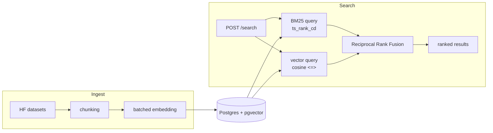

# Semantic Search over Indian Case Law

Finding a relevant Indian court judgment today means either paying for a
commercial legal database, or keyword-searching Indian Kanoon and hoping the
right words are in the text. Neither handles the case where you know *what
happened* but not the *legal terms of art* a judgment would use — "a company
run into the ground by its own directors" won't keyword-match "oppression and
mismanagement," even though that's exactly the doctrine you're looking for.

This project is a free, open search backend over Indian case law that ranks
results by **both** keyword match (BM25 via Postgres full-text search) and
meaning (embedding similarity via pgvector), fused with the same algorithm
Elasticsearch/OpenSearch use for hybrid search — so a query gets both an exact
citation lookup and a "these mean the same thing" match, whichever the search
actually needs.

**Live demo:** _TBD — filled in after deployment (Render + Supabase, see
[Deployment](#deployment))._

## What it does

- `POST /search` — hybrid keyword + semantic search over judgment text, returns
  ranked chunks with the parent judgment's metadata.
- `GET /judgments/{id}` — full judgment detail by id.
- A `hybrid_search/` module with zero framework dependencies, designed to be
  lifted into its own PyPI package unchanged: the fusion algorithm doesn't
  know SQLAlchemy or FastAPI exist.

## Numbers

| Metric | Value |
|---|---|
| Judgments indexed | _TBD after Week 1 ingest run_ |
| Search p50 / p95 latency | _TBD, measured locally against the seeded sample_ |
| Test coverage | _TBD, `uv run pytest --cov`_ |
| Uptime | _TBD once deployed_ |

(Deliberately left unfilled rather than guessed — updated as each is actually
measured, not estimated.)

## Architecture

Full schema + index rationale: [`docs/erd.md`](docs/erd.md).
Data provenance + licensing: [`docs/data_sources.md`](docs/data_sources.md).



### Why these choices

- **pgvector, not a separate vector store.** At the ~150–250K-vector scale
  this project targets, a dedicated vector database (Qdrant, Pinecone) isn't
  justified — it's another service to run, another failure mode, another
  thing to keep in sync with Postgres. pgvector's HNSW index handles this
  scale inside the same database that already holds the judgments.
- **Reciprocal Rank Fusion, not a weighted score blend.** `ts_rank_cd` and
  cosine distance live on incomparable scales; a weighted average needs
  per-query normalization and undefendable magic-number weights. RRF only
  consumes rank position — scale-invariant, one documented constant (`k=60`,
  [Cormack et al. 2009](https://plg.uwaterloo.ca/~gvcormac/cormacksigir09-rrf.pdf)).
- **HNSW over IVFFlat.** IVFFlat needs a `lists` parameter tuned to the
  *final* row count and gives poor recall if built before the table is
  populated — a bad fit for a resumable, incrementally-growing ingest. HNSW
  builds incrementally with better recall/latency at this scale.
- **Two open HF datasets, not scraping Indian Kanoon directly.** See
  [`docs/data_sources.md`](docs/data_sources.md) for the full reasoning —
  short version: no free bulk API, ToS-questionable at 50K-document scale,
  and a bare scraper loop isn't itself something worth shipping.
- **Render (app) + Supabase (Postgres), not Fly.io or Render's own free
  Postgres.** Render's free Postgres now expires (deletes) after 30 days.
  Fly.io dropped its free tier for new accounts. Supabase's free Postgres
  includes pgvector natively and only *pauses* on inactivity — a much safer
  failure mode for a link that sits unopened between interviews.

## Getting started

Requires [Docker](https://docs.docker.com/get-docker/) and
[uv](https://docs.astral.sh/uv/).

```bash
git clone <this-repo>
cd <this-repo>

# 1. bring up Postgres + pgvector and the app, two services
docker compose -f docker/docker-compose.yml up -d

# 2. install deps and run migrations
uv sync
uv run alembic upgrade head

# 3. pull a sample of judgments and run the ingestion pipeline
uv run python scripts/download_datasets.py --dataset injudgements
uv run python -m app.ingestion.ingest_cli --limit 500

# 4. try it
curl -X POST localhost:8000/search \
  -H "Content-Type: application/json" \
  -d '{"query": "oppression and mismanagement of a company"}'
```

## Testing

```bash
uv run pytest tests/unit          # ~25 tests, no DB/network required
uv run pytest tests/integration   # spins up a real pgvector/pgvector:pg15 container
```

CI (`.github/workflows/ci.yml`) runs lint → unit tests → integration tests →
Docker build on every push.

## Roadmap

- [x] Schema + migrations (Alembic, HNSW + GIN indexes)
- [x] Hybrid search module (RRF, framework-agnostic)
- [x] Two endpoints, ~25 unit tests, integration test on real Postgres
- [x] Docker + docker-compose (app, db)
- [x] CI: lint → test → build
- [ ] Week 1: ~500–1,000 judgments ingested end-to-end, CI green on a pushed branch
- [ ] Week 2–3: full ~48K-judgment corpus ingested as an offline batch job
- [ ] Deployed to Render + Supabase with a live URL
- [ ] Week 2 polish: frontend
- [ ] Later: auth (schema already has a `users` table for it)

## License

Code: MIT (or your preferred license — not yet chosen).
Data: see [`docs/data_sources.md`](docs/data_sources.md) — one source dataset
is CC-BY-NC-SA-4.0 (non-commercial).
