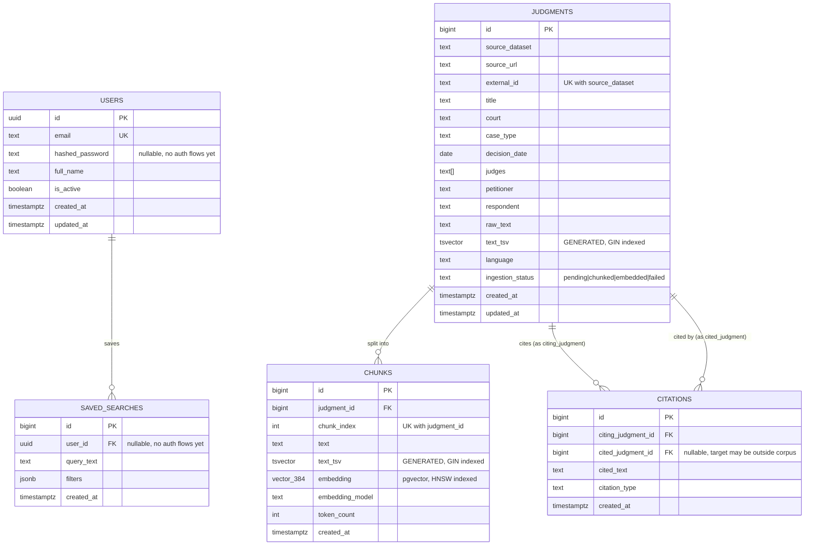

# Schema ERD

## Index rationale

| Index | Type | Why |
|---|---|---|
| `chunks_text_tsv_gin` | GIN on tsvector | Primary BM25 keyword-search path (`ts_rank_cd` + `@@`). |
| `chunks_embedding_hnsw` | HNSW, cosine ops | ANN search for the semantic path. Chosen over IVFFlat because IVFFlat needs a `lists` param tuned to *final* row count and gives poor recall if built before the table is populated — a bad fit for an incrementally-growing, resumable ingest. HNSW builds incrementally and gives better recall/latency at this project's ~150–250K vector scale. Built as its own migration (`0002`), separate from schema DDL, so routine schema changes don't pay HNSW build cost. |
| `judgments_text_tsv_gin` | GIN on tsvector | Doc-level keyword fallback / admin queries. |
| `judgments_court_idx`, `judgments_decision_date_idx` | btree | Filter predicates that commonly accompany a search query. |
| FK indexes on `chunks`, `citations`, `saved_searches` | btree | Join paths (chunk→judgment, citation→judgment, saved_search→user). |
